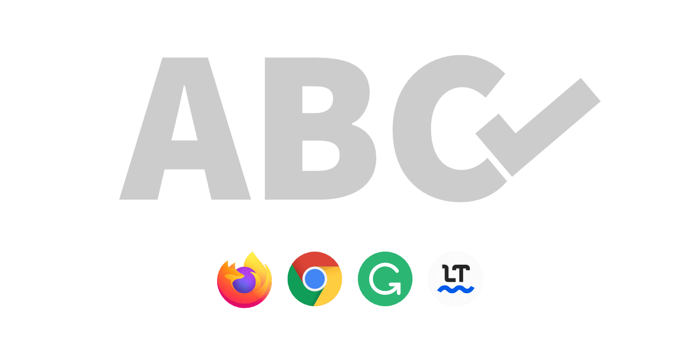
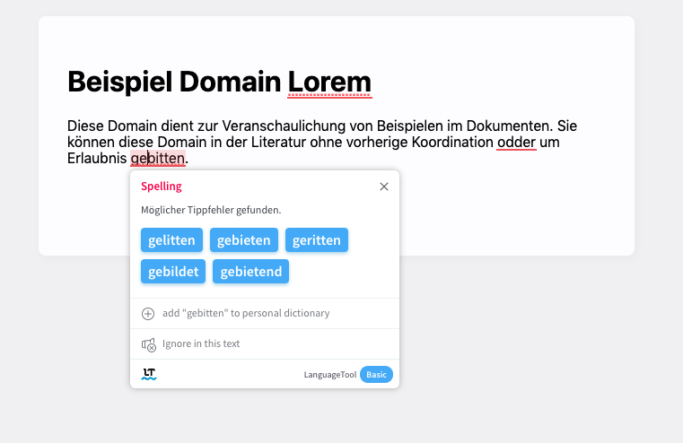

# Spellcheck Website Content Helper

- [Preview](#preview)
- [About](#about)
- [How to use](#how-to-use)
- [How it works](#how-it-works)
- [Todo](#todo)

<br>

---

<br><br>

## Preview

With [Grammarly](https://app.grammarly.com/)


<br>

With [LanguageTool](https://languagetool.org/)



---

<br><br>

## About

Enable browser + plugin spell checking ability within static website content elements. This is different from basically all other spell checker tools, as they work _only_ with input forms or editable elements.

**Important:** This script is intended for frontend views only. Don't use it in backend/admin tools.

### Challenges

- You want an additional quality measure (e.g. this can be a great visual aid for external QA teams)
- Text is mixed with code and HTML markup
- You need more than just spell checking (e.g. tone of voice, context, synonyms)
- Native browser spell checking is not enough
- There is no backend interface, which would automatically benefit from browser and plugin spell checking

### When to use

- Fast in-page QA workflows (independent of code or access to original text documents)
- As additional measure to other quality measures
- Only temporary, for text QA purposes. I highly suggest disabling the script in your browser plugin, whenever you don't need it.

### When to avoid use

- This script will break the page and things might not work and behave as they should.
  - Don't worry if the layout breaks, it's not permanent (just reload the page)
- Do not use this script in any backend environment or editors. These benefit from native spell checking abilities.

### Limitations

This script
- It makes sense if you use plugins like 'Grammarly' (and others). If you don't use them, there is no benefit from using this script.
- Spell checking will work anywhere, but still requires to be triggered manually. This is the same way as these tools work if you edit it in their own environment. They will react only to your input and interaction. It can be a bit annoying to do, but the results are surely worth it!

External spell checkers
- Some spel checking services have text length limits (depending on your plan). This might lead to long text being ignored.


### Alternatives

- Word-like software (these can be extended with better spell checkers like those named here)
- Write directly within spell checking tool editors

#### IDE solutions

**VSCode**

Great plugins that work with your code:

- [SpellChecker](https://marketplace.visualstudio.com/items?itemName=swyphcosmo.spellchecker)
- [Spell Right](https://marketplace.visualstudio.com/items?itemName=ban.spellright)


<br><br>

---

## How to use

### Prerequisites

- You know how to use browser plugins and can figure out the one we need.
- You have a spell checking plugin or want to install and use one.

### 1. Setup spell checking

Optional: If you don't already have one, install a language checking plugin like one of these:

- [Grammarly](https://app.grammarly.com/)
- [LanguageTool](https://languagetool.org/)

I've tested this script with these plugins. It probably works with more than just these.

**Important:** Go with a single solution!
Enabling multiple plugins simultaneously could lead to none of them working at all.

### 2. Setup script

1. Download the source code
2. Install the browser plugin [Tampermonkey](https://www.tampermonkey.net/)
3. Add a 'New userscript' in Tampermonkey and remove its default code
4. Copy the [JavaScript](/scripts/tampermonkey-spellcheck.js) in the userscript form
5. Edit the top-comment part and adjust the '@include' domains to your needs, e.g. like this:
`@include http://example.com/*` (just replace the examples)
  - The placeholder stands for any page on this domain
  - Make sure to correctly write 'http' or 'https' (if unsure, add both)


### 3. Use script

Before progressing: Make sure to read the [warnings](#warnings) section carefully!

#### Start

1. Go to any of the websites you defined in the script
   - This is NOT intended to work with forms and backend editing tools!
2. Check if your spell check plugin is enabled and the 'Tampermonkey' icon shows that the script for your website is working.

#### Check the content

3. Click through the website elements to trigger the plugins checking mechanisms.
   - Grammarly: It has a slight delay (1-2 seconds) and might require editing the text
   - LanguageTool: Double clicking in text triggers the check
     - Note that sometimes its icon will be shown in the bottom right of the full screen, not within the element itself
4. Try and change some text. Add some intentional mistakes to see if everything is working.
5. Now you should see the tool suggesting changes and - if enabled - the browsers native spell checker kick in.


#### What now?

- Fix the corrections at their source.
  - Suggestion: If you cannot access it or it's not your task to do so; save the new text, location and add a screenshot for other team members.


### 4. Advanced use

#### Trigger manually

You can also manually trigger the script by calling this in your browser console:

- `window.ccCheckSpelling()`

This will apply the required HTML changes to any elements to make the spell checkers work (again). Great for dynamically loaded content, that changes while you browse the page!

#### Enable globally

Just write the domains to use like this:

```
// @include http*://*
```

Or for typical DEV-environments:

```
// @include http*://localhost*
// @include http*://dev-*.test*
```


<br><br>

---

## How it works

The script sets _anything_ to be editable by adding the needed HTML attributes to any elements that usually contain text.

This allows you to trigger spell checking in any element, even if they are dynamically loaded after the page is finished!

<br><br>

---

## Todo

- Find out which HTML attributes are required exactly (it's a combination of them, but not all)
- Implement auto-reload for Single Page Applications (like Angular) on content/route change (?)
  - Alternative: Implement UI and hotkey to manually trigger the tool when needed
- Apply and trigger content editability only when and where needed
- Disable clickable elements to prevent redirection and unwanted UI updates?
- Legals: Find out if this tool violates any API restrictions (it shouldn't and is not intended so)
